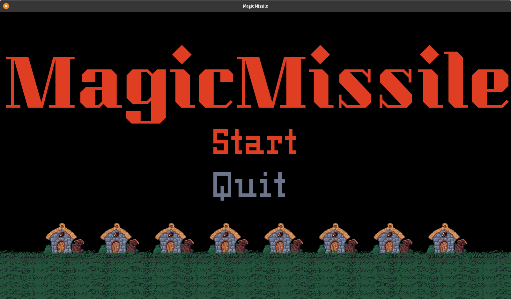
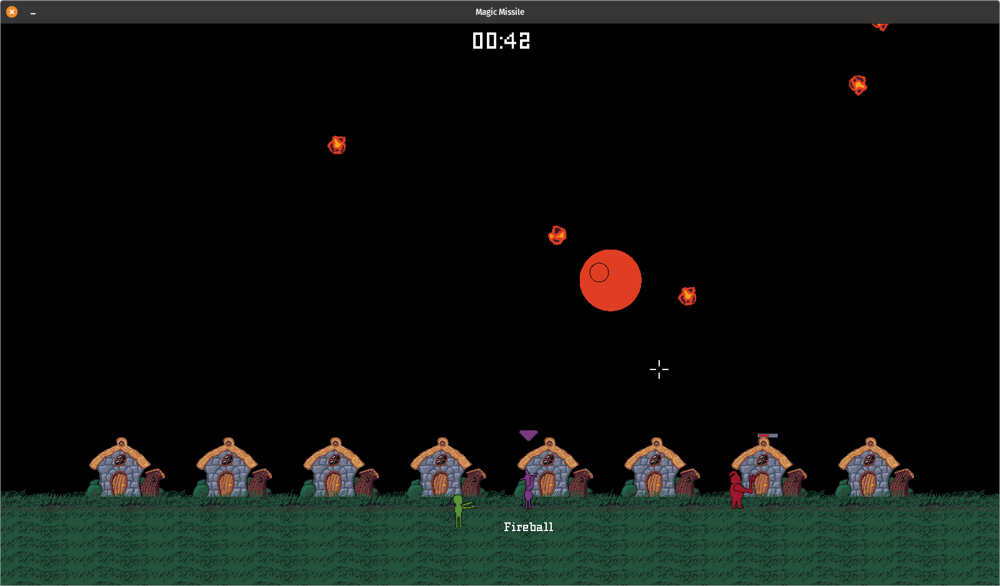
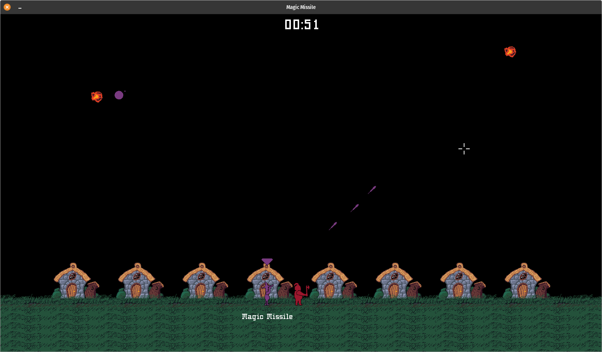

# Magic Missile

Your town has angered the Gods.

You can only DELAY THE INEVITABLE.

Created for the Ludum Dare 50 Game Jam.

Protect your town from raining meteors and roaming zombies.

### Controls

A/D to move a character left and right

Space to switch between characters

Wizard (Purple): Mouse to move, Left Click to shoot a spell

Fighter (Red): Automatically attacks. Just position him

### Credits

Gameplay and Graphics
Tim Sims

Sound
PMSFX
Tim Sims

### Links

[Magic Missile On Github](https://github.com/timsims1717/magicmissile)

[Magic Missile On Itch](https://thetimsims.itch.io/magic-missile)

[Magic Missile Ludum Dare Entry](https://ldjam.com/events/ludum-dare/50/magic-missile)

### Resources

[Pixel by Faiface](https://github.com/faiface/pixel) (Graphics Library)

[Beep by Faiface](https://github.com/faiface/beep) (Audio Library)
